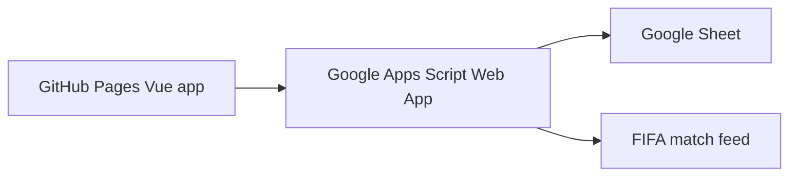

# landugui predict site

A friend-group FIFA World Cup prediction app using:

- Google Sheets as the database
- Google Apps Script as the backend
- Vue + Vite as the GitHub Pages frontend

The browser app never calls FIFA directly. Apps Script owns the FIFA sync, account approval, prediction writes, manual score reports, and leaderboard calculation.

## Architecture



## Sheets

Run `setup()` once in Apps Script. It creates these sheets:

- `Users`: account requests, approvals, roles, password hashes, session tokens
- `Matches`: schedule and live/final scores
- `Predictions`: one prediction per user per match
- `Audit`: manual score reports and admin actions
- `Config`: key/value settings

## Apps Script Setup

1. Create a Google Sheet.
2. Copy the Sheet ID from its URL.
3. Open Extensions -> Apps Script.
4. Paste `apps-script/Code.gs` into the Apps Script editor.
5. In `Code.gs`, set:
   - `SPREADSHEET_ID`
   - `ALLOWED_ORIGIN`
   - `FIFA_MATCHES_URL` is already set to FIFA's World Cup 2026 calendar endpoint.
6. Run `setup()` once. This creates or repairs the required sheet tabs.
7. Run `createFirstAdmin("your-name", "Your Name", "your-password")` once from the Apps Script editor.
8. Deploy as Web App:
   - Execute as: Me
   - Who has access: Anyone
9. Open the Web App URL with `?action=ping` at the end. It should return JSON with `"status":"ok"`.
10. Copy the Web App URL into the frontend `.env.local` as `VITE_API_BASE`.

## Odds API Setup

Do not put odds API keys in frontend code or GitHub.

This app uses two different providers:

- `odds-api.io`: live-only odds refresh during live betting
- `the-odds-api.com`: manual/admin refresh for incoming scheduled games

In Apps Script Project Settings, add Script properties:

- `ODDS_API_IO_KEY`: your `odds-api.io` key
- `THE_ODDS_API_KEY`: your `the-odds-api.com` key, only needed for the admin `Refresh odds` button

Optional Script properties:

- `ODDS_API_IO_BOOKMAKERS`, default `Bet365,Unibet`
- `ODDS_API_IO_SPORT`, default `football`
- `THE_ODDS_SPORT_KEY`, default `soccer_fifa_world_cup`
- `THE_ODDS_REGIONS`, default `eu`

Run `installLiveOddsTrigger()` once to create the one-minute live-odds trigger.

Live odds refresh only runs when a match is marked `live`, and it is throttled to at most once per minute. It uses `odds-api.io` and normally makes one odds request per minute after the live event has been mapped.

## Frontend Setup

```bash
npm install
npm run dev
```

Create `.env.local`:

```env
VITE_API_BASE=https://script.google.com/macros/s/YOUR_DEPLOYMENT_ID/exec
```

The app shows a backend connection line near the top of the page. Once `VITE_API_BASE` is set correctly and the Apps Script deployment is live, it should say `Backend connected`.

For GitHub Pages:

```bash
npm run build
```

Publish the `dist/` folder through your preferred GitHub Pages workflow.

## FIFA Sync Strategy

Apps Script includes `syncFifaIfNeeded()`.

- It skips FIFA calls unless a match is near or currently active.
- It throttles calls to at most once every 6 minutes.
- Manual score reports from approved users update the Sheet immediately.

Because FIFA web endpoints can change, keep the FIFA parsing isolated in `normalizeFifaMatches_()` inside `apps-script/Code.gs`.

## Scoring

The starter leaderboard uses:

- 3 points: exact score
- 1 point: correct result direction
- 0 points: otherwise

You can change this in `scorePrediction_()`.
